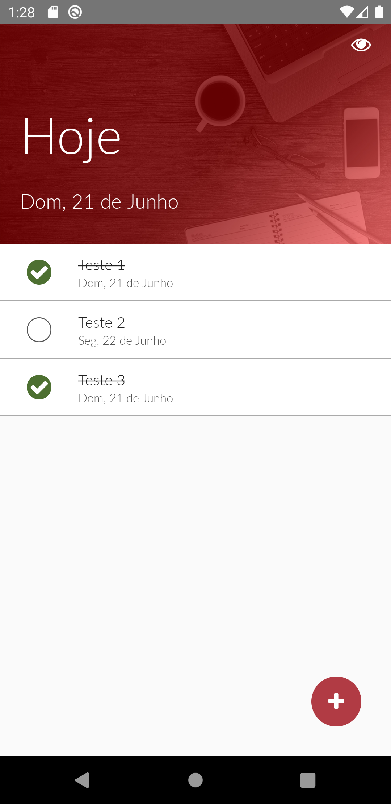
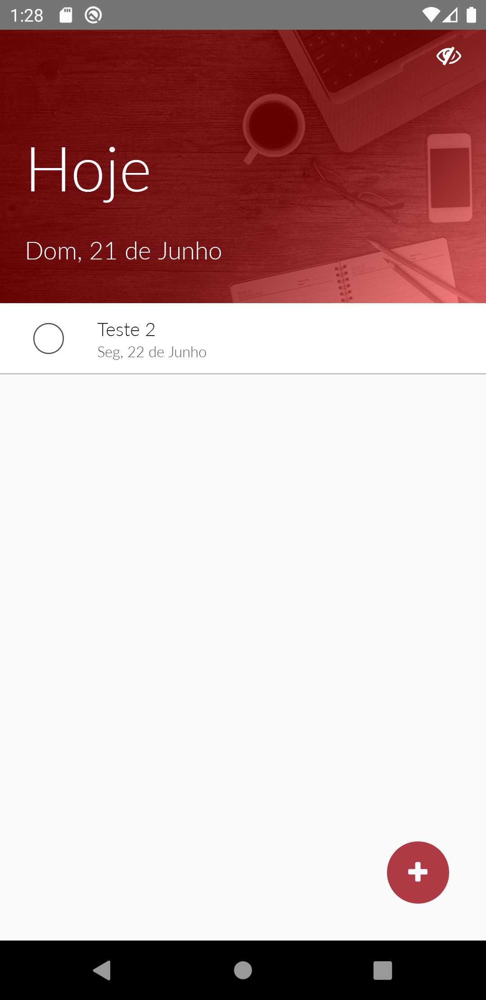
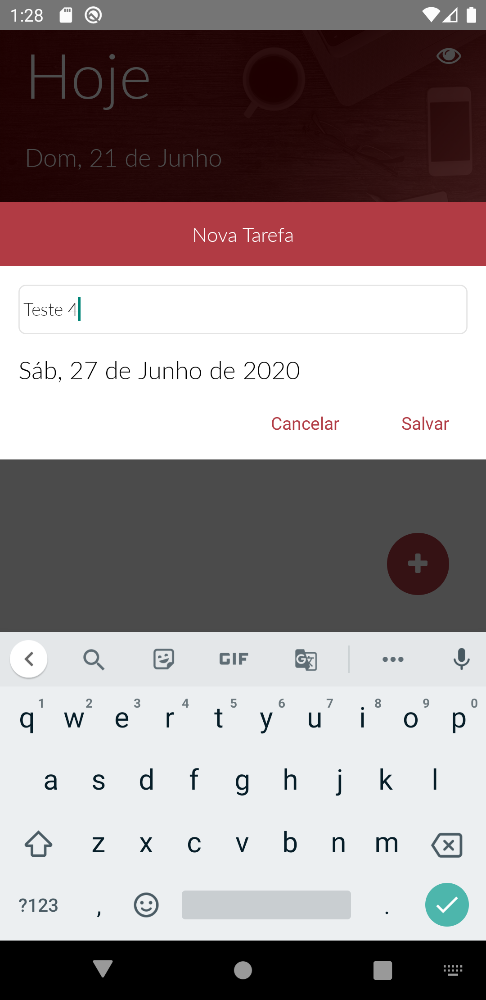

## Sobre o projeto

Tasks - Criação de uma aplicação em que tem como objetivo de criar uma tarefa em determinado ponto no tempo e a tarefa é adicionada.

O projeto até o momento adiciona a tarefa mas não é redirecionada ao dia marcado pois ainda há falta do back-end.

## Layout

  

  

  

## Tecnologias

As seguintes ferramentas usadas na criação do projeto:

- [Node.js][nodejs]
- [React][reactjs]
- [React Native][rn]

[nodejs]: https://nodejs.org/
[reactjs]: https://reactjs.org
[rn]: https://facebook.github.io/react-native/