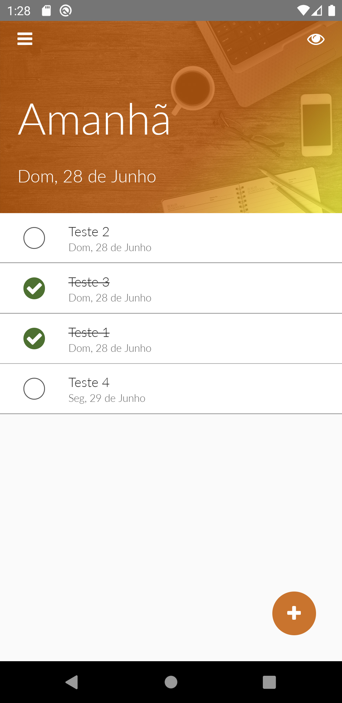

## Sobre o projeto

Tasks - Criação de uma aplicação completa em que tem como objetivo de criar uma tarefa em determinado ponto no tempo e a tarefa é adicionada ao banco de dados utilizado na aplicação.

O projeto ainda está em construção...
## Layout
- Login/Registro

  

  

  
  
  

 

- Criação e listagem das Tasks

  

  
  
  

 

  

  
  
  

 

- Exclusão de uma Task

  

## Tecnologias

As seguintes ferramentas usadas na criação do projeto:

- [Node.js][nodejs]
- [React][reactjs]
- [React Native][rn]

[nodejs]: https://nodejs.org/
[reactjs]: https://reactjs.org
[rn]: https://facebook.github.io/react-native/